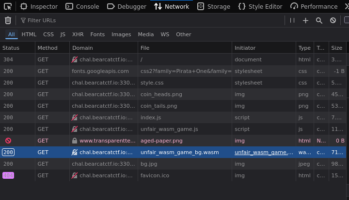

## Solution

For this challenge, I opened the devtools network tab and noticed
that this game was partially written in WebAssembly.

I assumed the flag would have to be in there, so I asked Claude Code
to decompile the webassembly and find the flag, which it did.

## Flag

`BCCTF{Fl1p&F1sH}`
